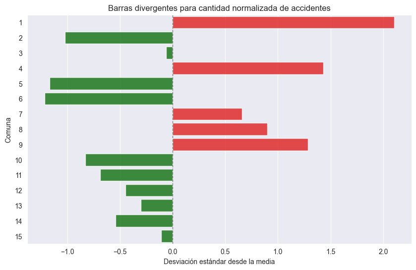
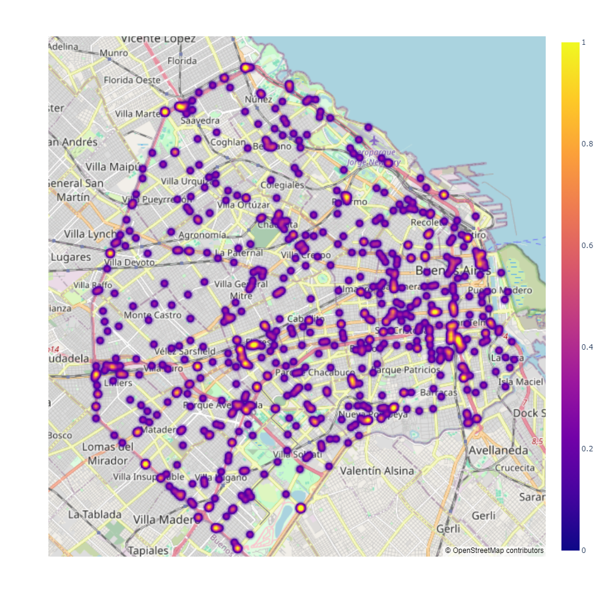

# Siniestros Viales en CABA
Este repositorio corresponde al Proyecto Individual N° 2, Data Analytics, del Bootcamp Henry.   
 

    

 

## Contexto
El rol a desarrollar es de analista de datos al servicio del Observatorio de Movilidad y Seguridad Vial (OMSV) de la Ciudad de Buenos Aires, con el objetivo de generar información que permita a las autoridades locales tomar medidas para disminuir la cantidad  de víctimas fatales de los siniestros viales.

## Índice 
[Estructura del proyecto](#estructura-del-proyecto) 
[Fuentes de datos](#fuentes-de-datos) 
[ETL](#etl) (Extract, Transform and Load) 
[EDA](#eda) (Exploratory Data Analysis) 
[KPIs](#kpis) (Key Performance Indicators) 
[Dashboard](#dashboard)  
[Conclusiones](#conclusiones) 
[Recomendaciones](#recomendaciones) 
[Contacto](#contacto)  

## Estructura del Proyecto 
[Assets](Assets): Carpeta con imagenes para diferentes usos. 
[CleanData](CleanData): Carpeta con archivos de datos limpios para uso en base de datos y EDA. 
[Datasets](Datasets): Carpeta con los datasets utilizados 
[PowerBI](PowerBI): Carpeta con archivo .pbix para Poer BI 
[SQL_Database](SQL_Database): Carpeta con script MySQL para generar base de datos. 
[EDA](EDA.ipynb): Notebook con el Análisis exploratorio de los datos. 
[ETL](ETL.ipynb): Notebook con transformaciones a archivos para limpieza y posterior análisis. 
[Notas](NOTAS_HOMICIDIOS_SINIESTRO_VIAL.pdf): Diccionario de datos y aclaraciones. 

## Fuentes de datos
El Observatorio de Movilidad y Seguridad Vial (OMSV), que se encuentra bajo la órbita de la Secretaría de Transporte del Gobierno de la Ciudad Autónoma de Buenos Aires, nos provee un dataset ([click aquí](https://cdn.buenosaires.gob.ar/datosabiertos/datasets/transporte-y-obras-publicas/victimas-siniestros-viales/homicidios.xlsx)) en formato excel con las siguientes hojas: 

- HECHOS: datos de siniestros de tránsito con víctimas fatales, con las columnas descriptas en el diccionario.
- DICCIONARIO_HECHOS: Información sobre las variables de la tabla hechos. 

 

- VICTIMAS: datos de las víctimas fatales de siniestros de tránsito, con las columnas descriptas en el diccionario. 

- DICCIONARIO_VICTIMAS: Información sobre las variables de la tabla víctimas. 

 

Además, se obtuvo un dataset con los datos de población por comuna para Buenos Aires, disponible en [este link](https://www.indec.gob.ar/ftp/cuadros/poblacion/proy_1025_depto_caba.xls), y que contiene la población para cada comuna y total de CABA obtenidas del censo del año 2010, y las estimaciones de la población por comuna y total para los años siguientes hasta 2025.

## ETL  

Se realizó un [ETL](ETL.ipynb) para limpiar los datos provistos, eliminando columnas innecesarias, imputando valores faltantes y realizando las modificaciones de formato que requiere la posterior carga de los archivos en la base de datos MySQL para uso en análisis. Los datos limpios fueron exportados a la carpeta [Datasets](Datasets).  
Luego, en el [script de MySQL](SQL_Database\siniestros_viales.sql), se utilizan estos archivos para generar una base de datos relacional. PowerBI utiliza el conector a MySQL para acceder a los datos para análisis. Addemás, en Power Query se realizaron algunas modificaciones adicionales para mejorar las visualizaciones y obtener métricas y KPI's de interés

## EDA  

En el [Análisis exploratorio de los datos](EDA.ipynb), se realizaron búsquedas de valores faltantes, duplicados, outliers y correlación entre variables. Además, se visualizaron los datos tanto de hechos como de víctimas, y se calcularon y graficaron los KPI´s solicitados. Allí encontrarás gráficas como:  
 

 

## KPIs 
Se solicitaron dos KPI´s:  
- Variación porcentual de la tasa de homicidios con respecto al semestre anterior. Objetivo: reducir un 10% la tasa de homicidios en siniestros viales.  
- Variación porcentual de la cantidad de accidentes de tránsito con víctima fatal en moto respecto al año anterior. Objetivo: reducir un 7% la cantidad de siniestros con víctima fatal en moto.  

Aquí vemos la vista de los KPI´s del dashboard para el primer semestre de 2018:  
 

## Dashboard 
El reporte final se realizó utilizando Microsoft Power BI, y puedes acceder en este [archivo](PowerBI/dashboard_siniestros.pbix).  
Allí tendrás acceso a visualizaciones que tienen alto impacto en la generación de insights para el objetivo de prevención de accidentes de tránsito. El reporte es interactivo, por lo que aplicando filtros y recorriendo las diferentes páginas, podrás profundizar en los detalles que necesitas. Aquí muestro una de las páginas del Dashboard dedicada a las características de las víctimas:  

 

## Conclusiones 
En base a los análisis realizados, podemos enumerar las siguientes conclusiones:  
### Tendencias temporales:

- Se observa una leve mejoría en el número de accidentes de tránsito mortales año tras año.
- Los meses con mayor cantidad de accidentes son diciembre en general y noviembre específicamente para mujeres.
- Los picos de accidentes en el día del mes son el 17 y el 20, mientras que las mujeres tienen picos cada 5/6 días (5, 11, 17, 22 y 27).

### Tendencias por día de la semana y franja horaria:

- Los fines de semana, especialmente los sábados, son los días con mayor cantidad de accidentes.
- Sin embargo, en mujeres, los días con más muertes son miércoles y viernes.
- La mayoría de los accidentes ocurren en la franja horaria de la mañana, con un máximo alrededor de las 6/7 am, aunque en mujeres el máximo es a las 9/10 am.

### Distribución por comunas y tipo de calle:

- Las comunas 1, 4 y 9 son las que tienen más accidentes de tránsito.
- Las comunas 2, 3 y 5 tienen una proporción más alta de mujeres en los accidentes.
- Las avenidas son el tipo de calle con más accidentes.

### Distribución por género y tipo de vehículo:

- En general, hay más muertes de hombres en la Avenida General Paz.
- Las mujeres tienen una mayor proporción de accidentes en calles.
- Los hombres tienen una proporción más alta de muertes en moto que las mujeres.
- El promedio de edad de las mujeres fallecidas es mayor que el de los hombres.

### Participación y acusaciones en accidentes:

- Cuando la víctima es un hombre conductor, la mayoría de los acusados son autos y camiones.
- Cuando la víctima es una mujer peatón, la mayoría de los acusados son vehículos de pasajeros.

### Tendencias por momento del día:

- En ambos sexos, la mañana es el momento más frecuente para los accidentes, aunque en mujeres hay menos accidentes durante la noche y la madrugada.

## Recomendaciones

- Programas de educación vial diferenciados por género: Desarrollar programas de educación vial que se enfoquen en las necesidades y comportamientos específicos de cada género. Por ejemplo, capacitación para mujeres sobre seguridad peatonal y para hombres sobre conducción segura de motocicletas.

- Estrategias de control de velocidad en avenidas: Implementar estrategias de control de velocidad específicas en avenidas, como instalación de radares de velocidad y señalización clara de los límites de velocidad, con un enfoque especial en avenidas con mayor incidencia de accidentes, como la Avenida General Paz.

- Campañas de concientización durante diciembre: Lanzar campañas de concientización y prevención de accidentes de tránsito durante el mes de diciembre, con énfasis en el cumplimiento de normas de tránsito, la responsabilidad al volante y la importancia de la conducción segura durante las festividades.

- Mejora de la seguridad peatonal en comunas específicas: Implementar medidas de mejora de la seguridad peatonal en comunas con alta incidencia de accidentes, como la instalación de pasos de peatones elevados, señalización mejorada y campañas de concientización dirigidas a peatones y conductores.

- Promoción de alternativas de transporte seguro: Promover alternativas de transporte seguro, especialmente para hombres que son conductores de motocicletas. Esto podría incluir campañas para fomentar el uso del transporte público, compartir viajes o el uso de medios de transporte alternativos más seguros.

## Contacto

Muchas gracias por llegar hasta acá! Espero que este repositorio te haya sido útil.  
Por cualquier duda o sugerencia al respecto de este proyecto, puedes contactarme en:  
[Linkedin](https://www.linkedin.com/in/alter-caimi)  
[Instagram](https://www.instagram.com/alt3rk/)  
[GitHub](https://github.com/AlterCaimi)  

